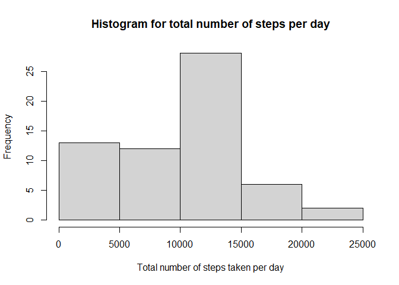
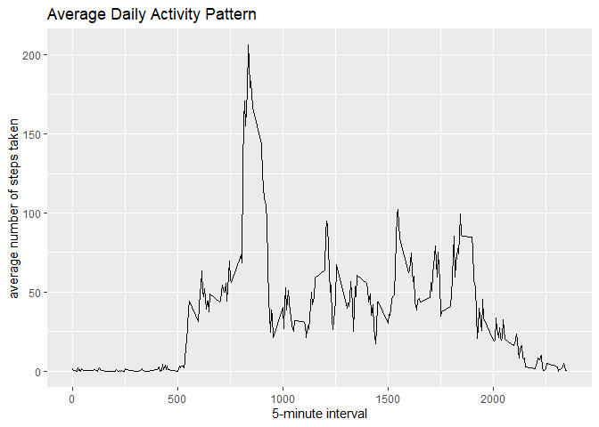
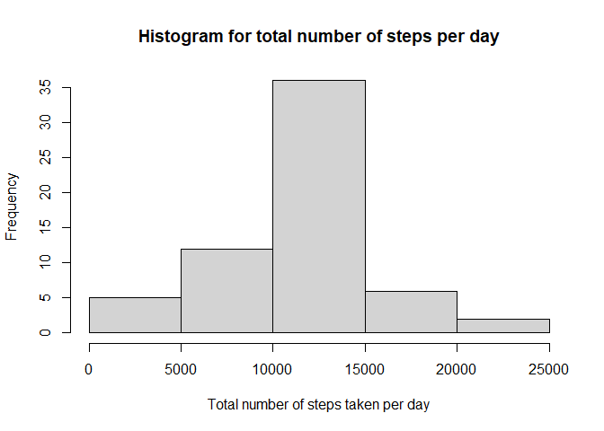
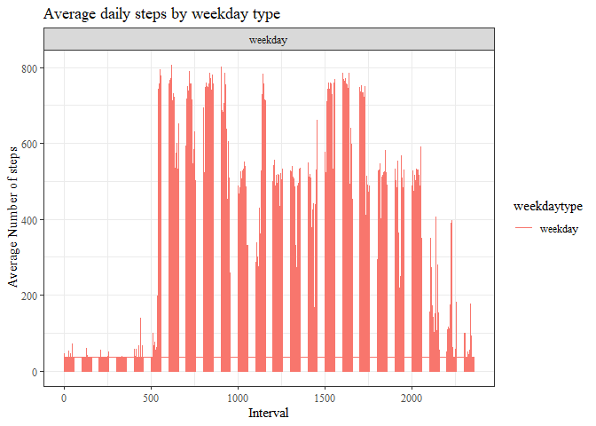

## Report on use of data from a personal activity monitoring device.

This report addresses the following five questions below:

## 1. Loading and preprocessing the data

Load packges

```r
library(dplyr)
```

```
## 
## Attaching package: 'dplyr'
```

```
## The following objects are masked from 'package:stats':
## 
##     filter, lag
```

```
## The following objects are masked from 'package:base':
## 
##     intersect, setdiff, setequal, union
```

```r
library(ggplot2)
```

Set working directory

```r
path = setwd("C:/Users/user/Desktop/Cousera/5. Reproducible Research/Week 2/Project/RepData_PeerAssessment1")
data_file <- unzip("activity.zip")  
```

Load the data (i.e. read.csv())

```r
activity <- read.csv(data_file,sep = ",")
summary(activity)
```

```
##      steps            date              interval     
##  Min.   :  0.00   Length:17568       Min.   :   0.0  
##  1st Qu.:  0.00   Class :character   1st Qu.: 588.8  
##  Median :  0.00   Mode  :character   Median :1177.5  
##  Mean   : 37.38                      Mean   :1177.5  
##  3rd Qu.: 12.00                      3rd Qu.:1766.2  
##  Max.   :806.00                      Max.   :2355.0  
##  NA's   :2304
```

Process/transform the data into a format suitable for your analysis

```r
activity$date <- as.Date(activity$date)
summary(activity)
```

```
##      steps             date               interval     
##  Min.   :  0.00   Min.   :2012-10-01   Min.   :   0.0  
##  1st Qu.:  0.00   1st Qu.:2012-10-16   1st Qu.: 588.8  
##  Median :  0.00   Median :2012-10-31   Median :1177.5  
##  Mean   : 37.38   Mean   :2012-10-31   Mean   :1177.5  
##  3rd Qu.: 12.00   3rd Qu.:2012-11-15   3rd Qu.:1766.2  
##  Max.   :806.00   Max.   :2012-11-30   Max.   :2355.0  
##  NA's   :2304
```

```r
dim(activity)
```

```
## [1] 17568     3
```

## 2.What is mean total number of steps taken per day?

Calculate the total number of steps taken per day

```r
total_steps <- tapply(activity$steps, activity$date, sum, na.rm=T)
```

Make a histogram of the total number of steps taken each day  

```r
hist(total_steps, main="Histogram for total number of steps per day", xlab="Total number of steps taken per day")
```

<!-- -->

Calculate Mean of the total number of steps per day  

```r
mean(total_steps, na.rm = T)
```

```
## [1] 9354.23
```

Calculate Median of the total number of steps per day  

```r
median(total_steps, na.rm = T)
```

```
## [1] 10395
```

## 3.What is the average daily activity pattern?
Make a time series plot (i.e. type = "l") of the 5-minute interval (x-axis) and the average number of steps taken, averaged across all days (y-axis) 


```r
averages <- aggregate(steps~interval, activity,
                      mean, na.rm=TRUE)
```


```r
ggplot(data=averages, aes(x=interval, y=steps)) +
    geom_line() +
    xlab("5-minute interval") +
    ylab("average number of steps taken")+
    ggtitle("Average Daily Activity Pattern")
```

<!-- -->

Which 5-minute interval, on average across all the days in the dataset, contains the maximum number of steps?

```r
averages[which.max(averages$steps),]
```

```
##     interval    steps
## 104      835 206.1698
```

## 4.Imputing missing values

Calculate and report the total number of missing values in the dataset (i.e. the total number of rows with NAs)


```r
sum(is.na(activity))
```

```
## [1] 2304
```

Devise a strategy for filling in all of the missing values in the dataset replacing NAs in steps column with mean:  

```r
activity$steps[is.na(activity$steps)] = 
mean(activity$steps,na.rm = T)
```

Create a new dataset that is equal to the original dataset but with the missing data filled in  

```r
activity_new = activity
summary(activity_new)
```

```
##      steps             date               interval     
##  Min.   :  0.00   Min.   :2012-10-01   Min.   :   0.0  
##  1st Qu.:  0.00   1st Qu.:2012-10-16   1st Qu.: 588.8  
##  Median :  0.00   Median :2012-10-31   Median :1177.5  
##  Mean   : 37.38   Mean   :2012-10-31   Mean   :1177.5  
##  3rd Qu.: 37.38   3rd Qu.:2012-11-15   3rd Qu.:1766.2  
##  Max.   :806.00   Max.   :2012-11-30   Max.   :2355.0
```

Calculate the total number of steps with NAs filled by mean taken per day  

```r
totalstepsfilled <- tapply(activity_new$steps, activity_new$date, sum, na.rm=T)
```

Make a histogram of the total number of steps taken each day  

```r
hist(totalstepsfilled, main="Histogram for total number of steps per day", xlab="Total number of steps taken per day")
```

<!-- -->

Calculate Mean of the total number of steps per day  

```r
mean(totalstepsfilled, na.rm = T)
```

```
## [1] 10766.19
```

Calculate Median of the total number of steps per day  

```r
median(totalstepsfilled, na.rm = T)
```

```
## [1] 10766.19
```

Do these values differ from the estimates from the first part of the assignment? 
The values of the mean and median after imputing missing values differ from their values earlier computed.


What is the impact of imputing missing data on the estimates of the total daily number of steps?
Both the mean and median marginally increased from *9,354.23* and *10,395* respectively to a single figure *10,766.19*.

## 5.Are there differences in activity patterns between weekdays and weekends?

Create a new factor variable in the dataset with two levels – “weekday” and “weekend” indicating whether a given date is a weekday or weekend day.  

```r
activity_new = mutate(activity_new, weekday = as.factor(weekdays(date)))
```

Creating a function that are going to be used to replace weekdays by "weekend" and "weekday":

```r
fun2replace = function(x){if (x == "samedi" | x =="dimanche") {
        y = "weekend"
} else {y = "weekday"}}
```


```r
activity_new$weekdaytype = as.factor(sapply(activity_new$weekday,
                                              fun2replace))
```

Make a panel plot containing a time series plot (i.e. type = "l") of the 5-minute interval (x-axis) and the average number of steps taken, averaged across all weekday days or weekend days (y-axis). The plot should look something like the following, which was creating using simulated data:

calculating avg number of steps taken by weekday and weekend days  

```r
averages_new <- aggregate(steps~interval, activity_new,
                      mean, na.rm=TRUE)
```

Then making time series plot  of the the 5-minute interval and the average number of steps taken, averaged across weekday and weekend days  

```r
g = ggplot(activity_new, aes(x = interval, y = steps, color = weekdaytype))
```


```r
g + geom_line() + ggtitle("Average daily steps by weekday type") +
        facet_wrap(~weekdaytype, ncol = 1, nrow = 2) + 
        xlab("Interval") +
        ylab("Average Number of steps") +
        theme_bw(base_family = "serif")
```

<!-- -->
